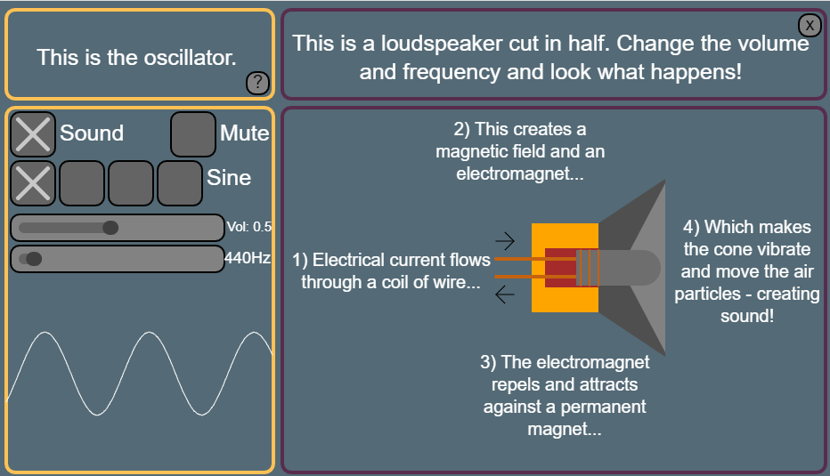

# Explore-a-Synth
A teaching tool to demonstrate the relationships between music, science, technology and engineering. 

Developed as a collaboration between UKESF and the AudioLab (University of York), funded by the IET and the IMechE through the Engineering Educational Grant Scheme.

*Note: This is a work in progress that is in early stages of development.*


## Dependencies
* p5 v1.1.9 (CDN URL)
* p5.sound v0.3.11 (CDN URL, via p5 v0.10.2 as not compatable with p5 v1.0.0)
* p5.touchgui v0.5.2 (CDN URL)
* p5.SceneManager (file in /libraries/)

## Getting started
To run the Explore-a-Synth, open **index.html** in a browser (note - full functionality can only be guaranteed using Google Chrome).

## Structure
### index.html
Contains the links to required libraries and Explore-a-Synth files.
Must contain a div with `id=instrument` to match `canvas.parent('instrument')` used in `instrumentv3.js`, for example:
```html
<div class="content">
	<div class="instrumentHolder" id="instrument"></div>
</div>
```
### instrumentv3
Main instrument file (v3):
- Initialises global GUI variables and state variables
- Creates global audio objects
- Sets up SceneManager to manage 3 different scenes that can be moved between:

	* [mainScene](#mainScene)
	* [soundScene](#soundScene)
	* [loudspeakerScene](#loudspeakerScene)

- Current state is stored to variables to allow passing of state between scenes
- Uses touchGUI for GUI elements (drawn to canvas, not DOM)

### mainScene
First scene to load:
- Displays oscillator controls, filtering controls, X-Y pad, keyboard, waveform plot, loudspeaker icon and record functionality
- UI elements created using touchGUI
- Location of UI elements based on values set in instrumentv3 (colWidth, rowHeight, spacingOuter etc)

### soundScene
Scene loaded when 'More' button pressed in sound section of mainScene:
- Displays controls for two oscillators (carrier and modulator) and waveform plots for the modulated signal, the unmodulated signal and the modulating signal
- UI elements created using touchGUI
- Location of UI elements based on values set in instrumentv3 (colWidth, rowHeight, spacingOuter etc)


### loudspeakerScene
Scene loaded when 'More' button pressed in loudspeaker section of mainScene:
- Displays oscillator controls and an animation of a sliced loudspeaker which reacts to controls
- UI elements created using touchGUI
- Location of UI elements based on values set in instrumentv3 (colWidth, rowHeight, spacingOuter etc)



## Contact
Any questions may be communicated via [Issues](https://github.com/tibbakoi/explore-a-synth/issues).

## License
<a rel="license" href="http://creativecommons.org/licenses/by-nc-sa/4.0/"></a><br /><span xmlns:dct="http://purl.org/dc/terms/" href="http://purl.org/dc/dcmitype/InteractiveResource" property="dct:title" rel="dct:type">Explore-a-Synth</span> by <span xmlns:cc="http://creativecommons.org/ns#" property="cc:attributionName">tibbakoi (Kat Young)</span> is licensed under a <a rel="license" href="http://creativecommons.org/licenses/by-nc-sa/4.0/">Creative Commons Attribution-NonCommercial-ShareAlike 4.0 International License</a>.
